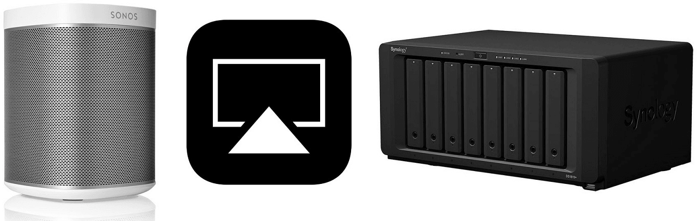
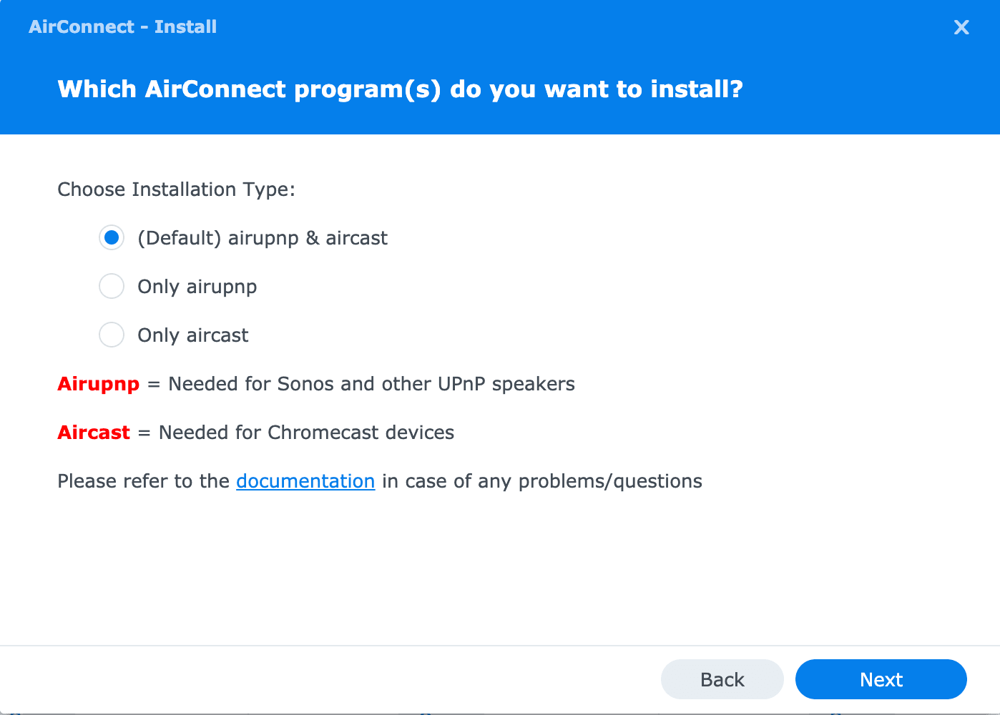
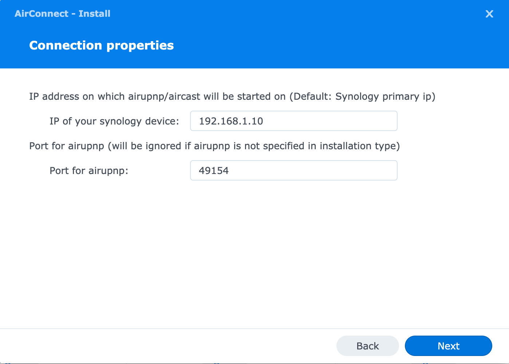

# AirConnect package for Synology NAS and Synology Router

[](https://github.com/eizedev/AirConnect-Synology/releases/latest) [](https://github.com/eizedev/AirConnect-Synology/releases) [](https://github.com/eizedev/AirConnect-Synology/issues) [](https://github.com/eizedev/AirConnect-Synology/actions/workflows/codacy-analysis.yml) [](https://www.codefactor.io/repository/github/eizedev/airconnect-synology) [](https://github.com/eizedev/AirConnect-Synology/discussions)



> Compatible with DSM 7! Please download package with name beginning with `AirConnect-dsm7-`.

A minimal Synology package for [AirConnect](https://github.com/philippe44/AirConnect).  
It allows you to use [AirPlay](https://en.wikipedia.org/wiki/AirPlay) to stream to **UPnP/Sonos** & **Chromecast** devices that do not natively support AirPlay.  

- [AirConnect package for Synology NAS and Synology Router](#airconnect-package-for-synology-nas-and-synology-router)
  - [Information](#information)
  - [How to install](#how-to-install)
    - [Download the pre-build Synology package](#download-the-pre-build-synology-package)
      - [Synology Router SRM](#synology-router-srm)
      - [Static packages](#static-packages)
    - [Upgrade from DSM6 to DSM7](#upgrade-from-dsm6-to-dsm7)
    - [Install via GUI (Package Center)](#install-via-gui-package-center)
      - [DSM 7](#dsm-7)
      - [DSM 6](#dsm-6)
    - [Logfiles](#logfiles)
  - [airconnect.conf](#airconnectconf)
  - [How it works](#how-it-works)
    - [Supported UPnP Speakers](#supported-upnp-speakers)
      - [How to detect UPnP speakers on your network](#how-to-detect-upnp-speakers-on-your-network)
      - [List of supported UPnP Speakers](#list-of-supported-upnp-speakers)
    - [Configuration](#configuration)
    - [Command-Line Arguemts](#command-line-arguemts)
      - [airupnp](#airupnp)
      - [aircast](#aircast)
    - [airupnp and aircast configuration](#airupnp-and-aircast-configuration)
    - [Player specific settings, hints and tips](#player-specific-settings-hints-and-tips)
      - [Sonos](#sonos)
      - [Bose SoundTouch](#bose-soundtouch)
      - [Pioneer/Phorus/Play-Fi](#pioneerphorusplay-fi)
  - [Build](#build)
    - [Run shellcheck (optional)](#run-shellcheck-optional)
    - [Build packages for all architectures](#build-packages-for-all-architectures)
    - [Build a package for a specific architecture](#build-a-package-for-a-specific-architecture)
  - [Troubleshooting](#troubleshooting)
    - [Cannot be installed or upgrade from an older version](#cannot-be-installed-or-upgrade-from-an-older-version)
    - [Issues](#issues)
    - [Multicast and IGMP Snooping/Proxy](#multicast-and-igmp-snoopingproxy)
    - [Debugging](#debugging)
      - [DSM 7](#dsm-7-1)
      - [DSM 5 and 6](#dsm-5-and-6)
  - [License](#license)
  - [Credits](#credits)

## Information

Here is some more information to get you started.

- AirConnect-Synology is a package for your synology devices to automate the installation and usage of [AirConnect](https://github.com/philippe44/AirConnect).
  - AirConnect-Synology releases will use the official AirConnect version + the current build date as tag/version (f.e. `0.2.25.0-20200511`)
  - AirConnect-Synology is compatible for almost all synology devices starting from DSM 5.0-4458 up to the newest and latest release of DSM 7
- Starting with DSM7 AirConnect, so both programs, `aircast` and `airupnp` will now run under the airconnect user (no root anymore!). And the complete package will now fully managed from DSM (Before some parts were managed in the startup scripts).

I own multiple Synology NAS devices and the current Synology Router. As long as that is the case, I will also update the releases regularly.  
If a release is missing or does not work on your device, please open an [issue](https://github.com/eizedev/AirConnect-Synology/issues), then I will check this and deliver it to.

## How to install

Every pre-build synology package in the [releases](https://github.com/eizedev/AirConnect-Synology/releases) section are including these two programs:

- `airupnp`
  - For **UPnP/Sonos players**
- `aircast`
  - For **Chromecast**

So you only need one package to support **UPnP**, **Sonos** and **Chromcast** devices.

### Download the pre-build Synology package

You can find the available packages under [releases](https://github.com/eizedev/AirConnect-Synology/releases) for the following synology DSM distributions (DSM 5, 6 and 7) and the different architecture groups of the synology NAS/Router devices.

| DSM Firmware Version                              | Package Naming                                                                         |
| ------------------------------------------------- | -------------------------------------------------------------------------------------- |
| DSM 5.0-xxxx AND DSM 6.0-xxxx (f.e. DSM 6.0-7321) | `AirConnect-x86-64-${VERSION}` (f.e. AirConnect-x86-64-0.2.50.5-20210630.spk)          |
| DSM 7.0-xxxx (f.e. DSM 7.0-40000)                 | `AirConnect-dsm7-x86-64-${VERSION}` (f.e. AirConnect-dsm7-86-64-0.2.50.5-20210630.spk) |

The minimum firmware version for the DSM7 packages is **DSM 7.0-40000)**.  
The minimum firmware version for the x86_64 package `AirConnect-x86-64-${VERSION}` is **DSM 6.0-7321**.  
For **all** other package the minimum firmware version is DSM **5.0-4458**.

If the `x86` (32-bit) package is not working on your device, please download the `x86-64` (64-bit) package instead.

| Architecture Group                | Architecture                                                                                                                                                              | Package to download                           |
| --------------------------------- | ------------------------------------------------------------------------------------------------------------------------------------------------------------------------- | --------------------------------------------- |
| **ARMv5**                         | 88f6282, 88f6281, 88f628x                                                                                                                                                 | `AirConnect-(dsm7-)arm5-${VERSION}`           |
| **ARMv7**                         | ipq806x, ipq806x, armada370, armadaxp, armada375, armada38x, alpine, alpine4k, monaco, comcerto2k, hi3535, dakota, ipq806x, northstarplus                                 | `AirConnect-(dsm7-)arm-${VERSION}`            |
| **ARMv7 Static**                  | noarch, ipq806x, ipq806x, armada370, armadaxp, armada375, armada38x, alpine, alpine4k, monaco, comcerto2k, hi3535, dakota, ipq806x, northstarplus                         | `AirConnect-a(dsm7-)rm-static-${VERSION}`     |
| **ARMv8**                         | rtd1296, armada37xx                                                                                                                                                       | `AirConnect-(dsm7-)aarch64-${VERSION}`        |
| **ARMv8 Static**                  | noarch, rtd1296, armada37xx                                                                                                                                               | `AirConnect-(dsm7-)aarch64-static-${VERSION}` |
| **PowerPC**                       | qoriq, Ppc853x                                                                                                                                                            | `AirConnect-(dsm7-)ppc-${VERSION}`            |
| **PowerPC Static**                | noarch, qoriq, Ppc853x                                                                                                                                                    | `AirConnect-(dsm7-)ppc-static-${VERSION}`     |
| **Intel - 32-bit**                | x86, cedarview, bromolow, evansport, braswell, broadwell, dockerx64, kvmx64, denverton, grantley, broadwellnk, Broadwellntbap                                             | `AirConnect-(dsm7-)x86-${VERSION}`            |
| **Intel/AMD - 64-bit (DSM 6.0+)** | x86_64, x64, cedarview, bromolow, avoton, braswell, broadwell, apollolake, dockerx64, kvmx64, denverton, grantley, broadwellnk, Broadwellntbap, v1000, geminilake, purley | `AirConnect-(dsm7-)x86-64-${VERSION}`         |

You can check which architecture you have in the `Package Arch` column on the Synology [What kind of CPU does my Synology NAS have?](https://www.synology.com/en-us/knowledgebase/DSM/tutorial/Compatibility_Peripherals/What_kind_of_CPU_does_my_NAS_have) site.

#### Synology Router SRM

For all the Synology **Routers** running Synology SRM you should use the **ARM** (ARMv7 - dakota, ipq806x, northstarplus) version. If the normal ARM package is not working on your device, please try **ARM Static** instead.

#### Static packages

On some devices, dependencies that are necessary to run airupnp or aircast are not available (mostly on older devices).
These dependencies are included in the static version of the packages. This is the reason why the static packages are bigger than the normal versions.

So in general always you should always use the normal package (with static in the name), not the static one. Only when the normal package does not work on your device, please test the static package instead.

> If the above **ARMv7** package will not work on your device, please download the latest `arm-static` package. The static package includes "static" binaries, that means, it includes binaries that have no external library dependencies and **should** be run on your ARMv7 device if the normal ARMv7 package fails.

> If the above **PowerPC** package will not work on your device, please download the latest `ppc-static` package. The static package includes "static" binaries, that means, it includes binaries that have no external library dependencies and **should** be run on your PPC device if the normal PPC package fails.

### Upgrade from DSM6 to DSM7

If you upgrade your NAS from DSM6 to DSM7, you should just download the new dsm7 package for your device. The old package and new DSM6 packages will not work anymore, since DSM7 changes a lot under the hood (no more root permissions for packages, minimum package version 7.0, etc.).  
Just download the DSM7 package and install it from the Package Center as usual.

If, after upgrading to DSM 7, the old package is still installed, please uninstall it and install it again.

If you encounter any problems, please read the [troubleshooting](#troubleshooting) section first.

### Install via GUI (Package Center)

#### DSM 7

- Open the Package Center app.
- Click on **Manual Install** and upload the package you just downloaded.
  - Select AirConnect packages that should be installed
    - 
  - Insert IP (defaults to the synology primary ip) and the port for airupnp
    - 

#### DSM 6

> Please use the older release for DSM 5 & 6: [0.2.50.5-20210706](https://github.com/eizedev/AirConnect-Synology/releases/tag/0.2.50.5-20210706)

- Open the Package Center app.
- Click on **Manual Install** and upload the package you just downloaded.

> On DSM5 and some DSM6 devices: As this package is not an official Synology package you may have to **Allow packages from any publisher** (Go to **Settings** and set the **Trust Level** to "**Any publisher**".)  

> Do not forget to **change back** the **Trust level** to "Synology Inc." for additional security.  

### Logfiles

- **AirConnect-Synology and AirConnect Log File**
  - The *AirConnect application logfile* is located at `/volume1/airconnect/log/airconnect.log` (default location)
    - This is a symlink of `/volume1/@appstore/AirConnect/log/airconnect.log`
  - You can open it using the Synology **FileStation** by navigating to `airconnect` - `log`
    - You can also open it after login with ssh to your NAS/Router: `sudo /usr/syno/bin/synopkg log AirConnect` or by using a command line utility like `more` (`more /volume1/airconnect/log/airconnect`) `tail` (`tail -100 /volume1/airconnect/log/airconnect`).
      - If you get a `permission denied`, you should use the full path, f.e. `more /volume1/@appstore/AirConnect/log/airconnect.log`
  - This log file is written by the AirConnect-Synology package. All log entries of the AirConnect application (airupnp + aircast) are also written into this log file.
  - This is the first place to look for errors.
- **Synology Service Log File**
  - The *synology dsm package logfile* ist located at `/var/log/packages/AirConnect.log`
  - This logfile is used from DSM/Synology for all installation/uninstallation/update purposes
  - In general you will only use it for debugging purposes

## airconnect.conf

> Only available for DSM 7 packages!

Starting with release `0.2.50.5-20210801` you can customize the configuration of AirConnect-Synology by using the config file at `/volume1/airconnect/airconnect.conf`.  
Please **stop** the package **before** changing the configuration.  
If you have edited the configuration while AirConnect is running please **restart** the AirConnect package.

The configuration options and default values are:

```bash
AIRCAST_ENABLED=1
AIRCAST_LATENCY="1000:2000"
AIRCAST_LOGLEVEL="all=info"
AIRUPNP_ENABLED=1
AIRUPNP_LATENCY="1000:2000"
AIRUPNP_LOGLEVEL="all=info"
AIRUPNP_PORT=49154
FILTER_AIRPLAY2_DEVICES="<NULL>,S1,S3,S5,S9,S12,ZP80,ZP90,S15,ZP100,ZP120,1.0,LibreWireless"
SYNO_IP="<your synology ip>"
```

| Configuration Option    | Values                                           | Mandatory     | Description                                                            |
| ----------------------- | ------------------------------------------------ | ------------- | ---------------------------------------------------------------------- |
| AIRCAST_ENABLED         | `0` or `1`                                       | Yes           | Enables or disables AIRCAST                                            |
| AIRCAST_LATENCY         | `[rtp][:http][:f]`                               | No            | RTP and HTTP latency (ms), ':f' forces silence fill                    |
| AIRCAST_LOGLEVEL        | `<log>=<level>`                                  | Yes           | logs: `all|raop|main|util|upnp`, level: `error|warn|info|debug|sdebug` |
| AIRUPNP_ENABLED         | `0` or `1`                                       | Yes           | Enables or disables AIRUPNP                                            |
| AIRUPNP_LATENCY         | `[rtp][:http][:f]`                               | No            | RTP and HTTP latency (ms), ':f' forces silence fill                    |
| AIRUPNP_LOGLEVEL        | `<log>=<level>`                                  | Yes           | logs: `all|raop|main|util|upnp`, level: `error|warn|info|debug|sdebug` |
| AIRUPNP_PORT            | `49154`                                          | Yes (airupnp) | Port on which airupnp should be started                                |
| FILTER_AIRPLAY2_DEVICES | `<NULL>,S1,S3,S5,S9,S12,ZP80,ZP90,S15,ZP100,...` | No            | See [Supported UPnP Speakers](#supported-upnp-speakers)                |
| SYNO_IP                 | `192.168.1.100`                                  | Yes           | The ip on which aircast/airupnp will be started                        |

Configuration options with `Mandatory = Yes` must exist in the configuration. Options with `Mandatory = No` are optional.

## How it works

It runs the AirConnect processes with the following options by default tuned for sonos:

```bash
/volume1/@appstore/AirConnect/airupnp -b [synology device local ip]:49154 -l 1000:2000 -x "/volume1/@appstore/AirConnect/config.xml" -o "<NULL>,S1,S3,S5,S9,S12,ZP80,ZP90,S15,ZP100,ZP120,1.0,LibreWireless" -z -f "/volume1/@appstore/AirConnect/log/airconnect.log" -d all=info  
/volume1/@appstore/AirConnect/aircast -b [synology device local ip] -l 1000:2000 -x "/volume1/@appstore/AirConnect/config-cast.xml" -z -f "/volume1/@appstore/AirConnect/log/airconnect.log" -d all=info
```

### Supported UPnP Speakers

> On **DSM7** you can just change the parameter `FILTER_AIRPLAY2_DEVICES` in the configuration file [airconnect.conf](#airconnectconf). You could also remove these configuration parameter to allow all airplay2 devices.

To speed up the detection of Sonos/UPnP/DLNA speakers and to not discover speakers which natively supports airplay, this synology package will only include the devices mentioned in the [List of supported UPnP Speakers](#list-of-supported-upnp-speakers).

> If you have another UPnP based speaker that you want to be supported by this package which is not in the list below, please open an [issue](https://github.com/eizedev/AirConnect-Synology/issues) and let me know (Please tell me the product name (**model name**, **model number** etc.)), then i will include it to the default configuration.

>With `-o <NULL>,S1,S3,S5,S9,S12,ZP80,ZP90,S15,ZP100,ZP120,1.0,LibreWireless` the sonos/UPnP speakers that are natively supporting AirPlay or AirPlay2 will be ignored from AirConnect/airupnp and only the ones listed with `-o` will be used. Since no new "non airplay" speakers (from sonos) will be released in the future, that should work in any case. So they will be not displayed twice in the list.

#### How to detect UPnP speakers on your network

To find UPnP speakers, their device_description URL and the model number, follow the following steps.

If you are familiar with linux commands you could use `tcpdump` to discover upnp devices on your network. You can install tcpdump on any synology NAS by using he integrated synology diagnostic tools. Just execute as root via SSH `synogear install` to install the diagnostic tools. See documentation here: [FAQ-synogear](https://github.com/SynoCommunity/spksrc/wiki/FAQ-synogear).  
Synogear also installs a few other useful linux/busybox commands. I have installed the diagnostic tools (synogear) on every synology device that i own.

**Change en0 to your network adapter name** (wait a few seconds until the devices get discovered)

`sudo tcpdump -vv -A -s 0 -i en0 host 239.255.255.250 and port 1900 | grep LOCATION`


Then you need to find your device ip and catch the location URL.

With the `curl` command (or the browser of your choice) you can then search for the `modelNumber` in the device xml configuration:

`curl http://192.168.1.122:1400/xml/device_description.xml | grep modelNumber`


S12 is a Sonos Play:1 in this example.

This modelNumber is the number that i need to extend the following [List of supported UPnP Speakers](#list-of-supported-upnp-speakers).

#### List of supported UPnP Speakers

| Model Number  | Friendly Name                       | Comment (Sonos seriesid, etc.) |
| ------------- | ----------------------------------- | ------------------------------ |
| S1            | Sonos Play:1 (old model)            | A101                           |
| S3            | Sonos Play:3                        | A100                           |
| S5            | Sonos Play:5                        | P100                           |
| S9            | Sonos Playbar                       | A100                           |
| S12           | Sonos Play:1                        | A200                           |
| S15           | Sonos Connect                       | S100                           |
| ZP80          | Sonos Connect (old model)           | C100                           |
| ZP90          | Sonos Connect                       | C100                           |
| ZP100         | Sonos Connect:Amp (old model)       | P100                           |
| ZP120         | Sonos Connect:Amp                   | P100                           |
| 1.0           | LibreWireless based Speakers        | LibreSyncDMR                   |
| LibreWireless | LibreWireless based Speakers        | LibreSyncDMR                   |
| `<NULL>`      | All speakers without a model number |                                |

See [Command-Line Arguemts](#command-line-arguemts) for more information about these arguments.

These default options should work for most of you but can also be changed by using a [configuration file](#configuration).

Both processes are running with the low-privilege user `airconnect`.

### Configuration

If you would like to tweak the AirConnect configuration you can also use the AirConnect configuration file.
> Before continuing please check the [official readme](https://github.com/philippe44/AirConnect#config-file-parameters) for more information. I'm not going to explain how it generally works here.

### Command-Line Arguemts

#### airupnp

```bash
v0.2.41.0 (Dec  8 2020 @ 18:43:14)
See -t for license terms
Usage: [options]
  -b <server>[:<port>]  network interface and UPnP port to use
  -a <port>[:<count>]   set inbound port and range for RTP and HTTP
  -c <mp3[:<rate>]|flc[:0..9]|wav|pcm>  audio format send to player
  -g <-3|-1|0>          HTTP content-length mode (-3:chunked, -1:none, 0:fixed)
  -u <version>  set the maximum UPnP version for search (default 1)
  -x <config file>      read config from file (default is ./config.xml)
  -i <config file>      discover players, save <config file> and exit
  -I                    auto save config at every network scan
  -l <[rtp][:http][:f]> RTP and HTTP latency (ms), ':f' forces silence fill
  -r                    let timing reference drift (no click)
  -f <logfile>          write debug to logfile
  -p <pid file>         write PID in file
  -m <n1,n2...>         exclude devices whose model include tokens
  -n <m1,m2,...>        exclude devices whose name includes tokens
  -o <m1,m2,...>        include only listed models; overrides -m and -n (use <NULL> if player don't return a model)
  -d <log>=<level>      Set logging level, logs: all|raop|main|util|upnp, level: error|warn|info|debug|sdebug
  -z                    Daemonize
  -Z                    NOT interactive
  -k                    Immediate exit on SIGQUIT and SIGTERM
  -t                    License terms
```

#### aircast

```bash
v0.2.41.0 (Dec  8 2020 @ 18:41:57)
See -t for license terms
Usage: [options]
  -b <address>          network address to bind to
  -a <port>[:<count>]   set inbound port and range for RTP and HTTP
  -c <mp3[:<rate>]|flc[:0..9]|wav>      audio format send to player
  -v <0..1>              group MediaVolume factor
  -x <config file>      read config from file (default is ./config.xml)
  -i <config file>      discover players, save <config file> and exit
  -I                    auto save config at every network scan
  -l <[rtp][:http][:f]> RTP and HTTP latency (ms), ':f' forces silence fill
  -r                    let timing reference drift (no click)
  -f <logfile>          Write debug to logfile
  -p <pid file>         write PID in file
  -d <log>=<level>      Set logging level, logs: all|raop|main|util|cast, level: error|warn|info|debug|sdebug
  -z                    Daemonize
  -Z                    NOT interactive
  -k                    Immediate exit on SIGQUIT and SIGTERM
  -t                    License terms
```

### airupnp and aircast configuration

By default the config file will **not** being used as long as the file is not created (And you are not running on debug log level). The file is **not** created by default.  

- Config File location for airupnp
  - `/volume1/airconnect/config.xml`
- Config File location for aircast
  - `/volume1/airconnect/config-cast.xml`

You can create each of these files manually or a reference version can be generated using the `-i [config file name]` command line parameter.
For the following example i am using the default configuration you can find above in the [How it works](#how-it-works) section. I am just change the `-x` parameter with the `-i` parameter.

Change the ip and parameters for your needs:

Example:

```bash
/volume1/@appstore/AirConnect/airupnp -b 192.168.1.249:49154 -l 1000:2000 -i "/volume1/@appstore/AirConnect/config.xml" -o "S1,S3,S5,S9,S12,ZP80,ZP90,S15,ZP100,ZP120" -z -f "/var/log/airconnect.log" -d all info -d main=info
```

After running this command, airupnp will be started until all needed information and devices are gathered, stopped and the resulted configuration will be written to the defined config file.

### Player specific settings, hints and tips

> Please check the original [Player specific hints and tips](https://github.com/philippe44/AirConnect#player-specific-hints-and-tips) from [philippe44](https://github.com/philippe44) for more information.

#### Sonos

The upnp version is often used with Sonos players. When a Sonos group is created, only the master of that group will appear as an AirPlay player and others will be removed if they were already detected. If the group is later split, then individual players will re-appear.

You need to use the Sonos native application for grouping / ungrouping.

When changing volume of a group, each player's volume is changed trying to respect the relative values. It's not perfect and still under test now. To reset all volumes to the same value, simply move the cursor to 0 and then to the new value. All players will have the same volume then. You need to use the Sonos application to change individual volumes.

To identify your Sonos players, pick an identified IP address, and visit the Sonos status page in your browser, like `http://192.168.1.126:1400/support/review`. Click `Zone Players` and you will see the identifiers for your players in the `UUID` column.

#### Bose SoundTouch

[@chpusch](https://github.com/chpusch) has found that Bose SoundTouch work well including synchronisation (as for Sonos, you need to use Bose's native application for grouping / ungrouping). I don't have a SoundTouch system so I cannot do the level of slave/master detection I did for Sonos

#### Pioneer/Phorus/Play-Fi

Check the [Configuration](#configuration) section on how to apply the below tuning to the configuration.

Some of these speakers only support mp3 and require a modified `ProtocolInfo` to stream correctly. This can be done by editing the [config file](#configuration) and changing `<codec>flac</codec>` to `<codec>mp3</codec>` and replacing the `<mp3>..</mp3>` line with:

```html
<mp3>http-get:*:audio/mpeg:DLNA.ORG_PN=MP3;DLNA.ORG_OP=00;DLNA.ORG_CI=0;DLNA.ORG_FLAGS=0d500000000000000000000000000000</mp3>
```

## Build

You need to install the following packages on your distribution:

- make
- shellcheck

After that you can start the build process by running `shellcheck` or directly with the build steps.

### Run shellcheck (optional)

```bash
make shellcheck
```

### Build packages for all architectures

```bash
make clean build-all
```

### Build a package for a specific architecture

```bash
ARCH=arm make clean build
```

Possible values for **ARCH**: `arm, aarch64, arm5, ppc, ppc-static, x86, x86-64`

You can find the built packages in the **dist** directory.

## Troubleshooting

### Cannot be installed or upgrade from an older version

If you get an error message that the package **cannot be installed** or **updated** or **started** when updating AirConnect-Synology, please **uninstall the old version** first (`Package Center -> AirConnect -> Uninstall`) and then install the new version. Uninstalling also removes the old scripts, references and configurations (only the logfile remains). Sometimes it can happen that the problem is already fixed with this.  

If the normal uninstallation also does not work, please cleanup the old package using SSH with root permissions:

- Delete old package (directory)
  - `rm -rf /var/packages/AirConnect`
- Delete old airconnect configuration directory
  - `synoshare --del TRUE airconnect`
- Delete old airconnect user(s) from a previous installation
  - `synouser --del airconnect`
  - `synouser --del airconnect__PKG_`
- Delete old airconnect group from a previous installation
  - `synogroup --del airconnect`

- After that please install the new package as found in [how-to-install](#how-to-install)

### Issues

If you have a problem installing or using one of these packages and/or are stuck, please open an [issue](https://github.com/eizedev/AirConnect-Synology/issues).  
It would be very helpful for me if you tell me the synology device you are using, the package you have downloaded and upload the two logfiles mentioned in the [Logfiles](#logfiles) section or include the important parts from the logfiles in the issue.

If the package was installed successfully and `airupnp` and `aircast` are running and no strange problems will be shown in the logfile but for you it is not working as excpeted, please consider opening an [issue](https://github.com/philippe44/AirConnect/issues) at the officiall AirConnect Repository.

### Multicast and IGMP Snooping/Proxy

Most of the problems with AirConnect are related to the local network configuration.
AirConnect (and therefore Sonos/Chromecast) require **Multicast** to function properly. You must ensure that the communication within your network supports multicast. Especially important is the communication:

> Chromecast/Sonos speakers <-> (WLAN)-Router <-> (Switch/Firewall <->) Smartphone which is used

So make sure that multicast is allowed on your router, your switches and your firewall and configure settings like IGMP snooping + IGMP proxy so that the communication is guaranteed. For testing, please deactive igmp snooping everywhere if you have activated it.  
I have activated but properly configured igmp snooping and igmp proxy + different VLANs. It will work with AirConnect, if properly configured.

- When players disappear regularly, it might be that your router is filtering out multicast packets. For example and testing, for a Asus AC-RT68U, you have to login by ssh and run `echo 0 > /sys/class/net/br0/bridge/multicast_snooping` but it does not stay after a reboot.
- Lots of users seems to have problems with Unify and broadcasting / finding players. Here is a guide [ubnt-sonos](https://www.neilgrogan.com/ubnt-sonos/) made by somebody who fixes the issue for his Sonos environment

For additional information, please check the following issues in the official AirConnect Repository:

- [Best Practises for getting AirUPnP working in networks?](https://github.com/philippe44/AirConnect/issues/270)
- [Troubleshooting Steps for airupnp AirPlay Devices not Appearing?](https://github.com/philippe44/AirConnect/issues/217)
- [Devices disappear after ~1-2 Minutes](https://github.com/philippe44/AirConnect/issues/189)
- [Devices found, but not being added](https://github.com/philippe44/AirConnect/issues/160)
- [Unable to Connect to "device"](https://github.com/philippe44/AirConnect/issues/246)

### Debugging

#### DSM 7

If you want to see more logs then change the AIRCAST_LOGLEVEL or AIRUPNP_LOGLEVEL from `all=info` in `/volume1/airconnect/airconnect.conf` to `all=debug` and restart the package.

#### DSM 5 and 6

If you want to see more logs then change the `-d all=info` parameter in `scripts/start-stop-status` to `-d all=debug` and rebuild the package, then [install it again](#install-via-command-line).

## License

- AirConnect: See [LICENSE](https://github.com/philippe44/AirConnect/blob/master/LICENSE).
- AirConnect-Synology: See [LICENSE](./LICENSE)

## Credits

Credits go to [@bandesz](https://github.com/bandesz) for the initial work and idea of a Synology package for AirConnect and of course to [philippe44](https://github.com/philippe44) for this great AirConnect application.  
