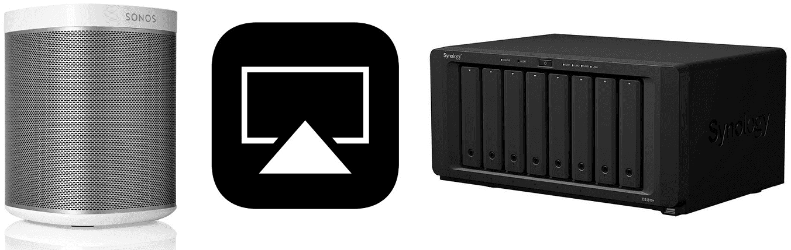
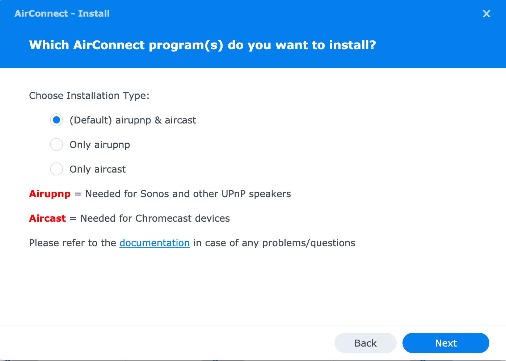
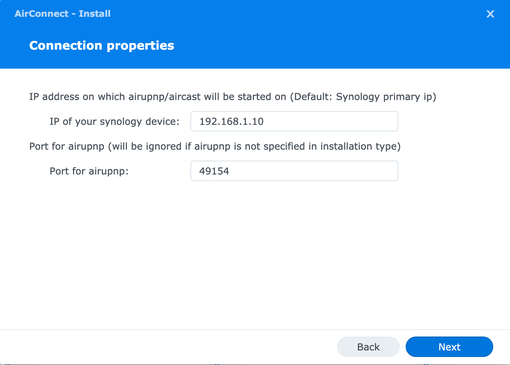
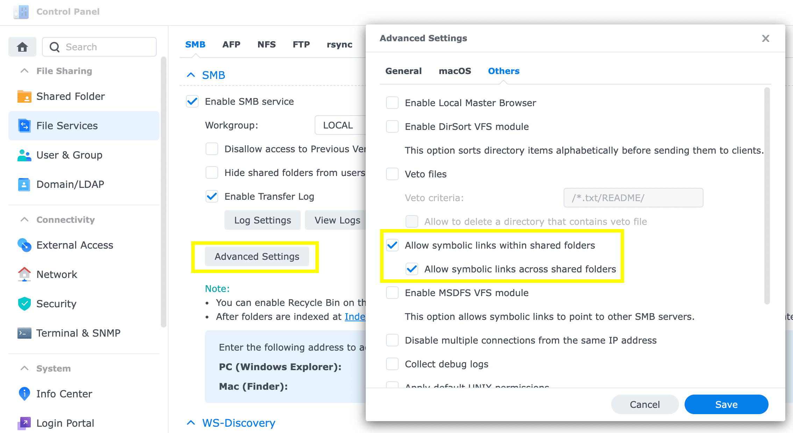

# AirConnect package for Synology NAS and Synology Router

<!-- === Badges: Release & distribution === -->

| Release                                                                                                                                                                   | Downloads                                                                                                                                                    | Package Source                                                                                                                                               |
| ------------------------------------------------------------------------------------------------------------------------------------------------------------------------- | ------------------------------------------------------------------------------------------------------------------------------------------------------------ | ------------------------------------------------------------------------------------------------------------------------------------------------------------ |
|  |  |  |

<!-- === Badges: Quality & community === -->

| License                                                                                        | Security Scan                                                                                                                                                                                            | Lint                                                                                                                                                                 | Issues                                                                                                                                          | Discussions                                                                                                                                                                |
| ---------------------------------------------------------------------------------------------- | -------------------------------------------------------------------------------------------------------------------------------------------------------------------------------------------------------- | -------------------------------------------------------------------------------------------------------------------------------------------------------------------- | ----------------------------------------------------------------------------------------------------------------------------------------------- | -------------------------------------------------------------------------------------------------------------------------------------------------------------------------- |
|  |  |  |  |  |

A Synology package for [AirConnect](https://github.com/philippe44/AirConnect): it lets
[AirPlay](https://en.wikipedia.org/wiki/AirPlay) stream to **Sonos/UPnP** and
**Chromecast** devices that don't natively speak AirPlay - install it, and your existing
speakers just show up as AirPlay targets. One package covers both device families; you
don't need to pick.

> 📦 **Also listed in [007revad's Synology Package Source](https://github.com/007revad/Synology_package_source).**
> Add it once in Package Center (`Settings` → `Package Sources` → `Add` → Name
> `007revad`, Location `https://spkrepo.007daver.workers.dev/`), then install/update
> AirConnect from the **Community** tab like any other Synology package - no manual
> downloads needed. See [discussion #189](https://github.com/eizedev/AirConnect-Synology/discussions/189).

## Table of contents

- [Which package do I need?](#which-package-do-i-need)
- [Features](#features)
- [Quick start](#quick-start)
- [Editing files from your PC](#editing-files-from-your-pc)
- [Logs](#logs)
- [Configuration](#configuration)
- [Background](#background)
- [Known limitations](#known-limitations)
- [Troubleshooting](#troubleshooting)
- [Building from source](#building-from-source)
- [License](#license)
- [Credits](#credits)

## Which package do I need?

Almost everyone wants the **DSM 7** line:

1. Check your device/router's CPU architecture on Synology's
   [What kind of CPU does my Synology NAS have?](https://www.synology.com/en-us/knowledgebase/DSM/tutorial/Compatibility_Peripherals/What_kind_of_CPU_does_my_NAS_have)
   page (or just try the `x86_64` package first if you're on any recent Intel/AMD-based
   NAS - it's by far the most common).
2. Download the matching `AirConnect-dsm7-<architecture>-<version>.spk` from the
   [latest release](https://github.com/eizedev/AirConnect-Synology/releases/latest).
3. Install it via Package Center (see [Quick start](#quick-start) below).

That's it for most people - the defaults just work, no configuration needed.

**Running a Synology Router (SRM), not a NAS?** Use the `arm` package - confirmed working
on a real RT2600ac.

**Full architecture matrix, static-package fallback, and the older DSM 5/6 line:** see
[doc/ARCHITECTURES.md](doc/ARCHITECTURES.md).

> **On very old hardware**, AirConnect can fail immediately with `FATAL: kernel too old` -
> a real, developer-confirmed issue, but **not predictable from your device model
> alone** (it depends on your current DSM patch level, not just kernel/platform). See
> [doc/TROUBLESHOOTING.md](doc/TROUBLESHOOTING.md#fatal-kernel-too-old--crashes-immediately-on-old-hardware)
> before assuming your device isn't supported.

## Features

- One package for both **Sonos/UPnP** and **Chromecast** devices - no need to choose
- Works out of the box with tuned defaults; nothing to configure for most setups
- Runs as a dedicated low-privilege `airconnect` user on DSM 7 (not root)
- Fully managed by DSM - Package Center install/upgrade/uninstall wizard, no manual
  service setup
- Optional: link `airconnect.conf`/logs/config files into a shared folder for SMB
  access without SSH (off by default)
- Automatic log rotation (50 MB cap, one backup kept)
- Fixed RTP/HTTP port range option for firewall rules
  ([#142](https://github.com/eizedev/AirConnect-Synology/issues/142))

## Quick start

### Install via Package Center

1. Download your package (see [Which package do I need?](#which-package-do-i-need)).
2. Open **Package Center** on your Synology device.
3. Click **Manual Install** and upload the `.spk` file you downloaded.
4. Select which binaries to install (both, or just one if you only need Sonos/UPnP _or_
   Chromecast):

   

5. Confirm the IP and port for `airupnp` (defaults to your device's primary IP - double
   check this if your device has a VPN, mesh, or other non-LAN default route):

   

6. Finish the wizard. AirConnect starts automatically; your Sonos/UPnP and Chromecast
   devices should appear as AirPlay targets within a few seconds.

> **DSM 5/6:** see [doc/ARCHITECTURES.md](doc/ARCHITECTURES.md#older-dsm-56-devices) -
> different (frozen) package line, same Manual Install steps.

### Upgrading

Just install the new package over the old one via Package Center - your `airconnect.conf`
is preserved automatically. If you're moving from DSM 6 to DSM 7, download the
`dsm7-`-prefixed package for your architecture instead of the old one (the old package
won't run under DSM 7).

If install/upgrade fails outright, see
[doc/TROUBLESHOOTING.md](doc/TROUBLESHOOTING.md#package-wont-install-update-or-start).

## Editing files from your PC

By default, nothing is exposed outside the package directory - edit `airconnect.conf` or
place a custom `config.xml`/`config-cast.xml` directly via SSH
(`/volume1/@appstore/AirConnect/`, adjust `/volume1` for your install volume).

If you'd rather edit these from your computer without SSH, check **"Enable shared-folder
links"** during install or upgrade (off by default; upgrading shows the same option
again, preselected with your current choice, so you can change your mind later without
reinstalling). This links `airconnect.conf`, the log, and (if present)
`config.xml`/`config-cast.xml` into the package's `airconnect` shared folder.
Unchecking it again removes just those links - never deletes the real files.

**Works over SMB only** - map the shared folder from Windows, Mac, or Linux (e.g.
`smb://<your-nas>/airconnect`); confirmed working, including editing and saving
`airconnect.conf` directly. **Not supported via File Station** (can't display symlinks
at all) **or AFP** (no equivalent setting). You'll also need to enable `allow symlinks`
under `Control Panel` → `File Services` → `SMB` → `Advanced Settings` on your Synology
device (a device-wide setting, not specific to this package) - activate both options
shown here:

> **The `airconnect` shared folder always exists**, whether or not you ever check this
> option - Synology's own packaging framework creates it unconditionally and gives
> packages no supported way to remove it again, even when nothing is linked into it.
> This is deliberate on Synology's part (a package silently deleting a shared folder
> could destroy real user data), not a bug here. If you don't want it around at all,
> remove it yourself: `Control Panel` → `Shared Folder` → select `airconnect` →
> `Delete`, or via SSH: `sudo synoshare --del TRUE airconnect`.
>
> **On uninstall**, this shared folder also doubles as a backup location:
> `airconnect.conf` and the log are always copied there first as real files (not
> symlinks) before the package directory is removed - regardless of whether you ever
> enabled shared-folder links - unless you check **"Delete the contents..."** in the
> uninstall dialog, since there's no point backing up something about to be deleted.

## Logs

- **AirConnect log**: `/volume1/@appstore/AirConnect/log/airconnect.log` (adjust
  `/volume1` for your install volume). View via SSH
  (`sudo /usr/syno/bin/synopkg log AirConnect`, or `tail -100 <path>`), or over SMB at
  `/volume1/airconnect/<packagename-lowercase>.log` if shared-folder links are enabled
  (see [above](#editing-files-from-your-pc)). Auto-rotates at 50 MB, keeping one backup
  (`airconnect.1.log`, deleted on next start).
- **DSM package log**: `/var/log/packages/AirConnect.log` - install/upgrade/uninstall
  history, mainly useful for debugging the package itself rather than AirConnect's
  runtime behavior.

## Configuration

Most setups need zero configuration - defaults are already tuned. If you do need to
change something (log level, device filter, latency, port range, or an advanced
upstream option via `config.xml`), see
**[doc/CONFIG.md](doc/CONFIG.md)** for the full `airconnect.conf` reference, supported
speaker list, command-line arguments, and player-specific tuning (Sonos, Bose
SoundTouch, Pioneer/Phorus/Play-Fi).

## Background

What's changed in this package recently:

- Brought current from a two-year-old release (1.8.3 → 1.11.3) after a long quiet
  period, plus an automated weekly upstream-check that opens a PR on new AirConnect
  releases (merge is always a manual, reviewed decision)
- Verified end-to-end on real hardware across DSM, DSM-on-router (SRM), and multiple
  device generations, not just built and assumed to work
- Several real packaging bugs found and fixed: daemonized processes incorrectly shown
  as "stopped" in Package Center, installation failing on Synology routers, a port-check
  bug that could refuse to start over a port that wasn't actually in use, a process-kill
  path that could in principle target an unrelated process
- Shared-folder use made fully opt-in (off by default) instead of always-on, addressing
  [discussion #132](https://github.com/eizedev/AirConnect-Synology/discussions/132)
- Ongoing CI hardening (checksum-verified upstream downloads, linting, security
  scanning) to catch problems before they ship, not after

## Known limitations

- The `armv5` and `armv6` packages currently declare the same Synology platform codes,
  so Package Center can't tell you which one your device needs - see
  [doc/ARCHITECTURES.md](doc/ARCHITECTURES.md#architecture-groups-dsm-7).
- Whether very old hardware can run the current package isn't predictable from the
  model alone, and there's no automated compatibility check yet at install time - see
  [doc/TROUBLESHOOTING.md](doc/TROUBLESHOOTING.md#fatal-kernel-too-old--crashes-immediately-on-old-hardware).
- The `airconnect` shared folder can't be removed by the package itself (a deliberate
  Synology restriction) - see [Editing files from your PC](#editing-files-from-your-pc).
- The legacy DSM 5/6 package line is frozen at AirConnect `0.2.50.5` and only receives
  packaging-level fixes, not upstream feature updates.
- SRM (Synology Router) support is confirmed on one router model
  (RT2600ac) - not independently verified across every router model and SRM version.

## Troubleshooting

Can't install, package shows as stopped when it isn't, players not appearing, or
anything else not working as expected - see **[doc/TROUBLESHOOTING.md](doc/TROUBLESHOOTING.md)**
first (install/upgrade failures, old-hardware kernel errors, multicast/IGMP network
issues, debug logging).

Still stuck? Open an [issue](https://github.com/eizedev/AirConnect-Synology/issues) with
your device model, the package you downloaded, and your logs (see [Logs](#logs)).

## Building from source

Pre-built packages cover every supported architecture already - you only need this if
you want a different AirConnect version or are changing the packaging scripts. See
**[doc/BUILD.md](doc/BUILD.md)**.

## License

- AirConnect (the upstream binaries): see its own
  [LICENSE](https://github.com/philippe44/AirConnect/blob/master/LICENSE).
- AirConnect-Synology (this packaging): [MIT](./LICENSE).

## Credits

- [@bandesz](https://github.com/bandesz) for the initial idea and work on a Synology
  package for AirConnect.
- [philippe44](https://github.com/philippe44) for AirConnect itself.
